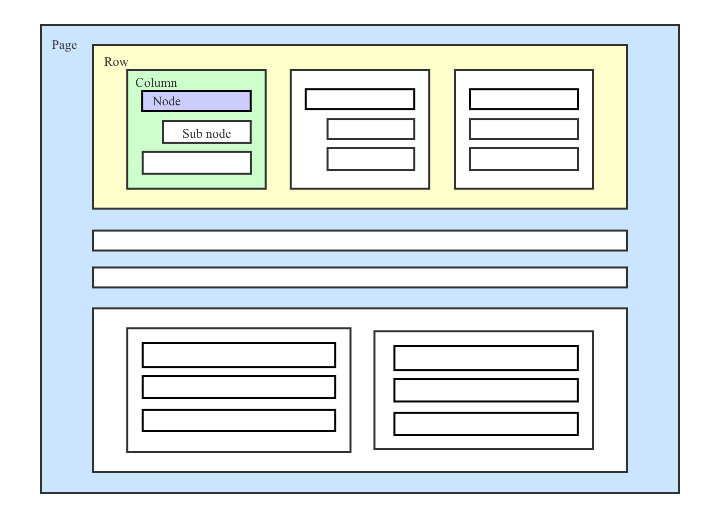
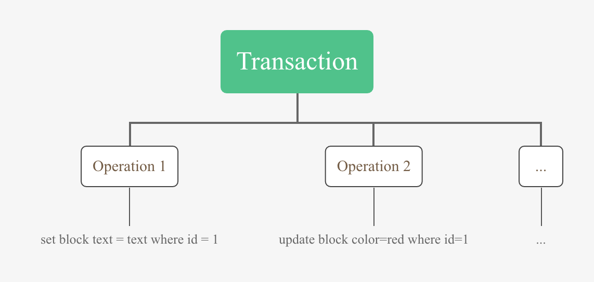
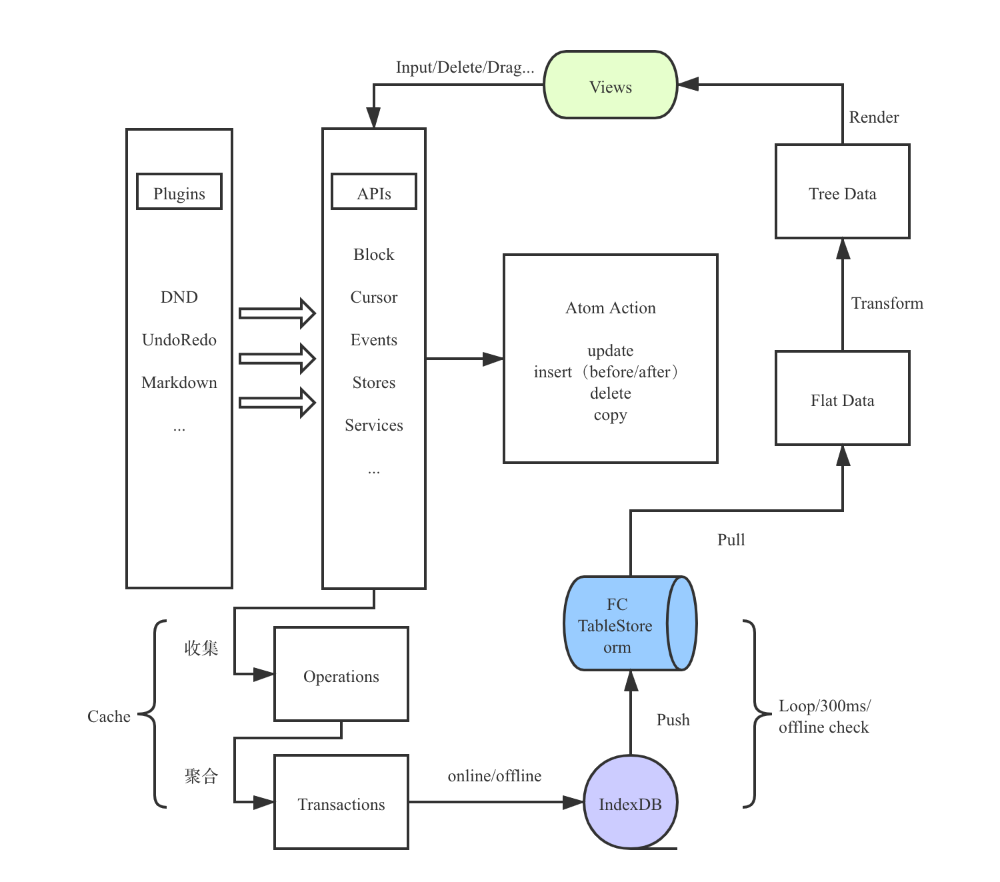
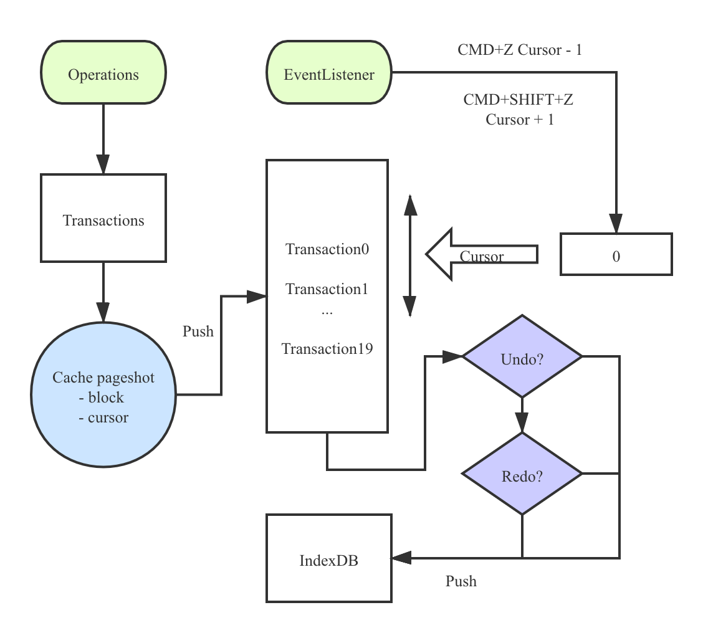
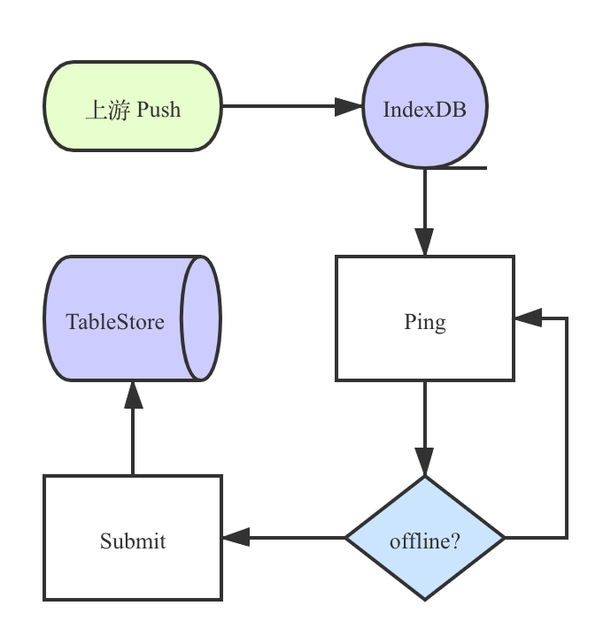

Block editor.
富文本（块）编辑器开发指北

---

# Intro

区分于传统的富文本编辑器，定义块的概念，编辑区内每部分内容由**块**拼接而成

从作用上分为内容块和结构块

### Content block

用来展示内容，作为页面内容的载体

- 普通文本
- 列表（有序、无序、待办、折叠）
- 标题（多级）
- 引用
- 分割线
- 代码块
- 页面

  ...

### Structural block

用来固定页面的结构，作为页面内容的骨架

- 行
- 列
- 页面

> 页面块时一个特殊的容器，本身是内容的一部分，同时也是作为结构承载级联的内容；此外，行列块属于隐藏块，用户无法再编辑区直接对行列块进行任意行为的操作（创建/拖拽/转换）

### Basic norm

1. 页面块可以成为任意节点的子节点同时是当前编辑器页面的根节点出现
2. 行列结构块的定义出于美观和数据结构规范不允许嵌套（当然也是可以嵌套）
3. 行块仅能作为当前页面（参见第一条）的子节点出现，不允许成为其他类型块的子节点
4. 列块仅能作为行块的子节点出现，不允许成为其他类型块的子节点

### Basic block

```ts
type BaseType = "page" | "bullet-list" | "order-list" | "text"| "code" | "hr" | "quote"; // ...

interface BaseBlock {
  type: BaseType;
  parent_type: BaseType | 'column';
  id: string;
  parent_id: string;
  content: string;
  children?: BaseBlock[];
  ...
}
```

### Column

```ts
interface Column {
  type: "column";
  parent_type: 'row';
  id: string;
  parent_id: string;
  children: BaseBlock[];
  ...
}
```

### Row

```ts
interface Row {
  type: "row";
  parent_type: 'page';
  id: string;
  parent_id: string;
  children: Column[];
  ...
}
```

# Blocks

一个页面的骨架大概如下



> 需要标明的是示意图的结构中中间内容块单独作为一行时没有外层的行列节点（出于结构统一的考虑行列节点的存在没有问题，出于 dom 结构的考虑将行列省略节省性能）

# Operations

记录用户的 **行为**

收集本次行为的所有特征，包括

- 块的 id
- 操作的类型（update/set）
- 更改的属性（颜色/背景/内容/块类型等）

...

# Transactions

用户的操作触发的行为会有很多且较为琐碎，针对用户的行为进行聚合上报



# Work flow

编辑器的大概工作流程



# 编辑区

### contentEditable

为了自定义的输入需求（富），使用 contentEditable 来开启 div 的输入行为来自定义输入框

- dangerouslySetInnerHTML

> React 作为前端框架时可编辑 div 的内部子组件无法动态更新，采用 dangerouslySetInnerHTML 来动态计算子元素内容进行渲染

### Cursor

光标的处理在编辑器中较为复杂，核心通过以下三个 API 实现光标的移动控制

- `window.getSelection()`
- `document.createRange()`
- `document.caretPositionFromPoint(x, y)`

> 光标的计算和设置较为繁琐，同时针对的不同 DOM 类型要做不同的适配

### Render

渲染数据结构

- 将接口返回的扁平数据转为树结构
- 递归渲染

```tsx
const transform = (type, ...) => {
  switch (type) {
    case 'init': return { children: transform('row', ...) }
    case 'row': return transform('column', ...)
    case 'column': return transform('node', ...)
    case 'node': return transform('node', ...)
  }
}

// Render
class App {
  renderNode = () => <></>;
  renderColumn = () => this.renderNode();
  renderRow = () => this.renderColumn();
  renderPage = () => this.renderRow();
  render = () => this.renderPage();
}
```

# Markdown

针对用户从外部粘贴的文本如何进行转换成页面的块结构

> 粘贴的所有文本都将进行 Markdown 转换的处理（导入的文件例如 Word、html 等文件的处理借助第三方库的解析，处理方式大同小异，为了性能的考虑放在服务端进行解析）


1. 将多行字符串根据首部缩进空格分割成树形数据结构同时根据 Markdown 正则识别块类型
2. 创建 Blocks

# Undo redo

撤销重做功能是编辑器不可少的一部分



# Drag & Drop

块编辑器是由各种类型的块组合而成，同时各种类型的块可以自由拖动组合

> 结构块中的行和列在设计中不允许被拖拽，这是为了避免各种行列结构嵌套的复杂情况发生

- 使用鼠标的 MouseOver、MouseUp 等事件模拟所有块的拖拽移动以及释放
- 使用原生 API 提供外部文件和图片的拖拽和释放
- 释放的位置支持目标块紧邻的上下或是目标块子块（通过释放的辅助线的缩进来区分）
- 目录侧和编辑器的拖拽兼容（独立的渲染逻辑）
- 特殊块处理

  - 根节点行列块的消除
  - 释放为新行/列位置的行列块的创建
  - 释放到页面块的上、下、子、内部的处理

  ...

> 由于拖拽 API 的相关兼容性问题以及更多的定制化需求页面的拖拽释放行为由鼠标事件的模拟拖拽和原生 API 结合使用

# Turn into

不同类型的块之间可以进行（批量）转换，需要注意如下

- 转换时候缩进子块（页面子块）的处理
-

> 图片、文件、分割线等特殊快无法转换

# IndexDB

由于受到离线编辑的限制，采用了 IndexDB 作为客户端的本地数据存储



# Last

一个完整的富文本（块）编辑器的开发远不止以上内容，还包括更多的功能以及需要注意的地方还有无尽匪夷所思的 BUG

此外，富文本编辑器的 DOM 结构一般较为复杂（数万的 DOM 在数据流的操作下对性能要求较为苛刻），编辑体验的提升是一直优化的方向，如何优化 DOM 结构数量，优化数据结构和算法是不断重构的目标

# The end

Thanks
