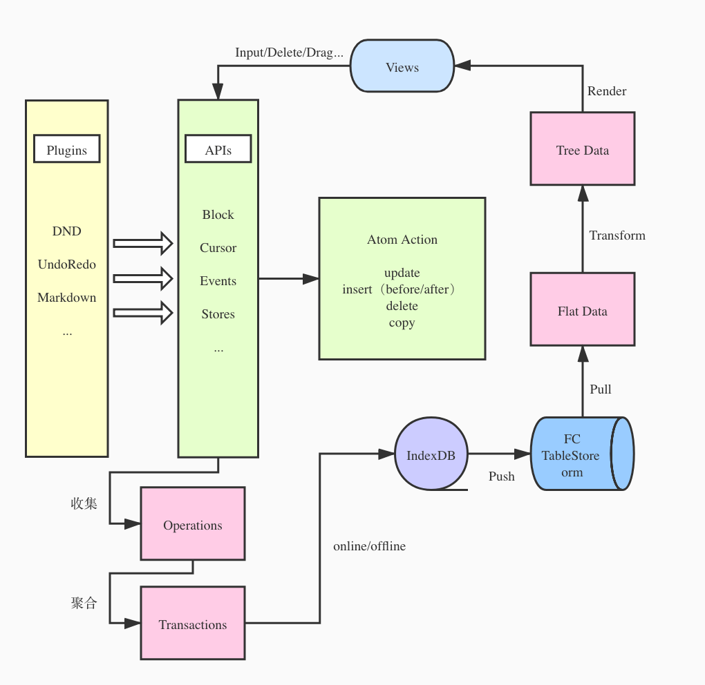

Block editor.

---

# 基本概念

区分于传统的富文本编辑器，定义块的概念，编辑区内每部分内容由**块**拼接而成

从作用上分为内容块和结构块

### 内容块

用来展示内容，作为页面内容的载体

- 普通文本
- 列表（有序、无序、待办、折叠）
- 标题（多级）
- 引用
- 分割线
- 代码块
- 页面
  ...

### 结构块

用来固定页面的结构，作为页面内容的骨架

- 行
- 列
- 页面

> 页面块时一个特殊的容器，本身是内容的一部分，同时也是作为结构承载级联的内容

### 关于行列页面的结构的简单规范

1. 页面块可以成为任意节点的子节点同时是当前编辑器页面的根节点出现
2. 行列结构块的定义出于美观和数据结构规范不允许嵌套（当然也是可以嵌套）
3. 行块仅能作为当前页面（参见第一条）的子节点出现，不允许成为其他类型块的子节点
4. 列块仅能作为行块的子节点出现，不允许成为其他类型块的子节点

### 基本块

```ts
interface BaseBlock {
  type: "page" | "bullet-list" | "order-list" | "text"| "code" | "hr" | "quote"; // ...
  id: string;
  parent: string;
  content: string;
  children?: BaseBlock[];
  ...
}
```

### 列

```ts
interface Column {
  type: "column";
  id: string;
  parent: string;
  children: BaseBlock[];
  ...
}
```

### 行

```ts
interface Row {
  type: "row";
  id: string;
  parent: string;
  children: Column[];
  ...
}
```

# 设计


